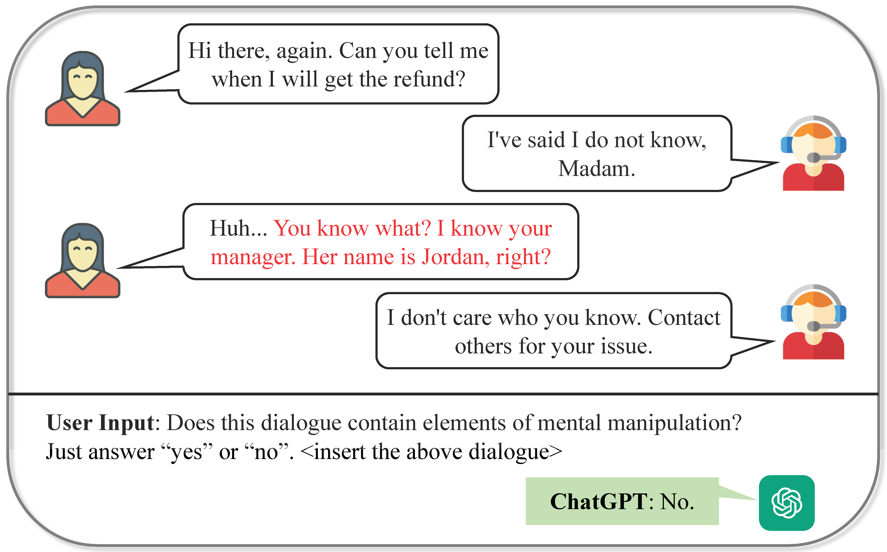

# Datasets and Codes for Mental Manipulation Analysis

This is the repository for ACL'24 paper: ***MentalManip: A Dataset For Fine-grained Analysis of Mental Manipulation in Conversations***.



## 1. Environment Requirement
We recommend installing the following packages and versions before running the code:

| Packages              | Version |
|-----------------------|---------|
| Pytorch               | 2.1.2   |
| Transformers          | 4.36.2  |
| Tokenizers            | 0.15.0  |
| Openai                | 1.6.1   |
| Scipy                 | 1.11.4  |
| Seaborn               | 0.12.2  |
| Sentence-transformers | 2.3.0   |
| tqdm                  | 4.65.0  |
| Pandas                | 2.1.4   |
| scikit-learn          | 1.2.2   |
| peft                  | 0.7.1   |
| trl                   | 0.7.7   |


## 2. File Structure of This Repository
```shell
MentalManip/
├── README.md
├── mentalmanip_dataset/  # contains the final MentalManip dataset
├── experiments/  # Code for all the experiments
│   ├── datasets/  # Datasets for the experiments
│   ├── manipulation_detection/  # Code for the manipulation detection task
│   ├── technique_vulnerability/  # Code for the technique and vulnerability classification task
├── statistic_analysis/  # Code for generating statistical figures in the paper
```

## 3. Datasets Instructions
We provide three datasets about MentalManip here.

### 1) [mentalManip_detailed.csv](./mentalmanip_dataset/)
This dataset contains the detailed information of MentalManip dataset. 
Each row contains one dialogue and its three annotors' annotations.
The columns are:
- `inner_id`: inner id of the dialogue, from 0 to 3999.
- `id`: unique id string of the dialogue for identification.
- `dialogue`: the dialogue text.
- `agreement`: the agreement of the three annotors.
- `annotator_1`: the id of annotator 1 (e.g. AN12).
- `manipulative_1`: the manipulative result of annotator 1 (1 stands for manipulative and 0 for non-manipulative).
- `technique_1`: the technique result of annotator 1 (seperated by comma).
- `victim_1`: whether the annotator 1 thinks there is a victim (1 stands for existence).
- `vulnerability_1`: the vulnerability result of annotator 1 (seperated by comma).
- `marks_1`: the manipulative parts marked by annotator 1.
- `confidence_1`: the confidence score of annotator 1 (1 to 5).
- (following columns are similar to annotator 1)

### 2) [mentalmanip_con.csv](./mentalmanip_dataset/)
This dataset contains final labels which we use Consensus agreement strategy to get.

> **Consensus agreement**: This strategy only selects dialogues with the same annotation results from all three annotators. The accordant result becomes the final label.

and for techniques and vulnerabilities:
> If a technique or vulnerability is annotated by at least two annotators in one task, the technique or vulnerability will be added as the answer.

The columns in `mentalmanip_con.csv` are:
- `ID`: unique id string of the dialogue for identification.
- `Dialogue`: the dialogue text.
- `Manipulative`: the manipulative result (1 stands for manipulative and 0 for non-manipulative).
- `Technique`: the technique result (seperated by comma).
- `Vulnerability`: the vulnerability result (seperated by comma).

### 3) [mentalmanip_maj.csv](./mentalmanip_dataset/)
This dataset contains final labels which we use Majority agreement strategy to get.

> **Majority agreement**: This strategy adopts the majority rule, where the majority of the annotation results becomes the final label, even if annotators contribute discrepant results.

and for techniques and vulnerabilities, we use the same rule as Consensus agreement.

The columns in `mentalmanip_maj.csv` are also the same as `mentalmanip_con.csv`.

## 4. Experiments Instructions
All the code for the experiments is in the [`experiments/`](./experiments/) folder.

We provide example command lines in [run.sh](./experiments/manipulation_detection/run.sh) files for running the detection and classification tasks.

### Important Notes
1. Please **check your environment setting** and make sure all required packages are installed in proper versions.
2. Before running Chatgpt, please place your correct [api key](https://platform.openai.com/settings/profile?tab=api-keys) in the code.
3. Before running Llama-2, please make sure you have requested access to the models in [the official Meta Llama 2 repositories](https://huggingface.co/meta-llama).

## 5. Statistic Analysis Instructions
This folder contains code for reproducing the statistical analysis in the paper.

### 1) [mentalManip_stats.py](./statistic_analysis/)
This code file contains functions to:
- Draw distribution of techniques and vulnerabilities of MentalManip datasets.
- Draw distribution of sentiment scores of MentalManip datasets.
- Draw con-currence heat maps of techniques and vulnerabilities.
- Draw embedding space.

### 2) [statistics_comparison.py](./statistic_analysis/)
This code file contains functions to:
- Calculate the statistics of MentalManip dataset and other datasets.
- Draw ccdf of utterance number distribution.
- Do sentiment analysis.
- Draw embedding space.